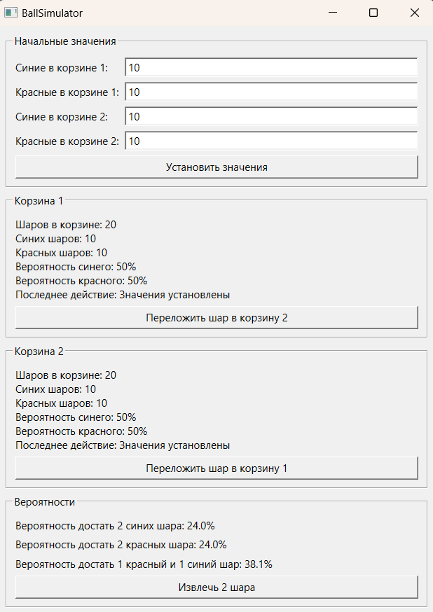

### **BallSimulator – Interactive Ball Probability Simulator**  

**A Qt/C++ application for modeling ball transfers between two baskets, performing random operations, and calculating real-time probabilities.**  

#### **Features:**  
**1. Basket Management:**  
- Set initial ball counts (manually via UI).  
- Move a random ball from Basket 1 to Basket 2.  
- Move a random ball from Basket 2 to Basket 1.  
- Remove two random balls (reduces total count).  

**2. Probability Calculations:**  
- Probability of drawing a red/blue ball from each basket.  
- Probability when removing 2 balls to get:  
  - 2 blue (`P(BB)`),  
  - 2 red (`P(RR)`),  
  - 1 red and 1 blue (`P(RB)`).  

**3. Visualization:**  
- Displays current basket states (ball counts, last action).  
- Dynamic probability updates after each operation.  

#### **Implemented Algorithms:**  
- Random event generation (`std::random_device`, `std::uniform_int_distribution`).  
- Conditional probability calculations based on current ball distribution.  

#### **Interface (`BasketGame` Class):**  
- **UI Controls:**  
  - Input fields for initial ball counts (`QLineEdit`).  
  - Action buttons:  
    - `move1to2Btn` – Move a ball from Basket 1 to Basket 2.  
    - `move2to1Btn` – Move a ball from Basket 2 to Basket 1.  
    - `remove2Btn` – Remove two random balls.  
  - Labels (`QLabel`) to display basket states and probabilities.  

- **Logic:**  
  - Data updates via `updateDisplay()`.  
  - Probability recalculations in `calculateProbabilities()`.  

#### **Dependencies:**  
- Qt 5.x / Qt 6.x (Widgets, Core).  
- C++17 (STL, `<random>`).  

#### **Build & Run:**  
```bash
git clone <repository>  
cd BallSimulator  
cmake -B build && cmake --build build  
./build/BallSimulator  
```  
#### **How it looks:**


